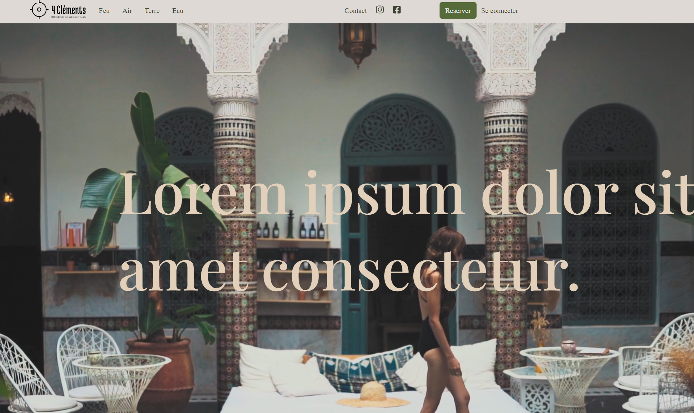
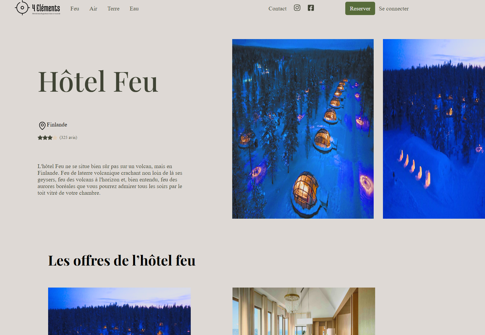
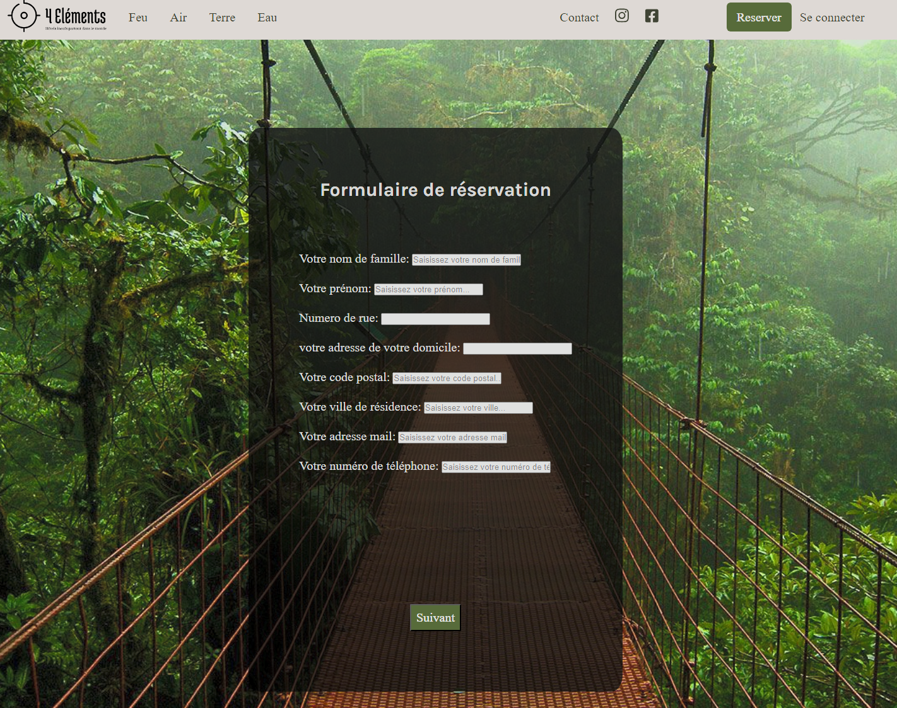

<h1 align="center">Les 4 éléments - Examen blanc du module Front-End 👋</h1>
<p>
  
  <a href="https://www.figma.com/design/AEZhaJnoPNjfJchgyYD549/4-elements-maquette?node-id=0-1&p=f&t=uJu9DQo4OXT7yuAx-0" target="_blank">
    
  </a>
</p> 

## Description du projet :
### Pour l'évaluation de l'examen blanc du module Front End, notre formatrice nous a transmis les différentes sources et le cahier des charges, afin d'effectuer l'intégration d'un site internet.
### Sujet de la maquette : l'entreprise franco-chinoise, qui se nomme les 4 éléments, a fait construire plusieurs hôtels à travers le monde et dans des endroits insolites.
### Pour cela, cette entreprise a sollicité des développeurs Web afin de réaliser leur site internet.
### "Des mises à jour seront envoyées progressivement afin d'améliorer leur site internet." 

## Visuel du site internet

<p align="center">
  <strong style="font-size: 22px;">Home Page</strong>
</p>
<p align="center">
  
</p>

<p align="center">
  <strong style="font-size: 22px;">Page Hôtel Feu</strong>
</p>
<p align="center">
    
</p>

<p align="center">
  <strong style="font-size: 22px;">Page du formulaire</strong>
</p>

<p align="center">
    
</p>

## Langage utilisé
* HTML
* SCSS
* Javascript
### Le langage Javascript a été utilisé pour l'utilisation du formulaire de réservation et le SCSS pour le design des différentes pages.


## Pour visualiser le rendu du projet, vous pouvez cliquer sur le lien ci-dessous :
### ✨ [Lien GIT Page](https://dev-it-seb.github.io/Les-4-elements/)

## Téléchargement de GIT
### Pour pouvoir consulter ce projet, vous devrez tout d'abord télécharger GIT depuis le site officiel en cliquant sur le lien ci-dessous :
### ✨ [Source officiel GIT](https://git-scm.com/downloads)

## Cloner le projet
### Après d'avoir installé GIT, ouvrez votre éditeur de code et saisissez la commande ci-dessous :

```sh
git clone https://github.com/Dev-IT-Seb/Les-4-elements.git
```
## Auteur

👤 **Sebastien C.**
* Lien Github: [@Dev-IT-Seb](https://github.com/Dev-IT-Seb)
* Promo 2025 (Webecom)